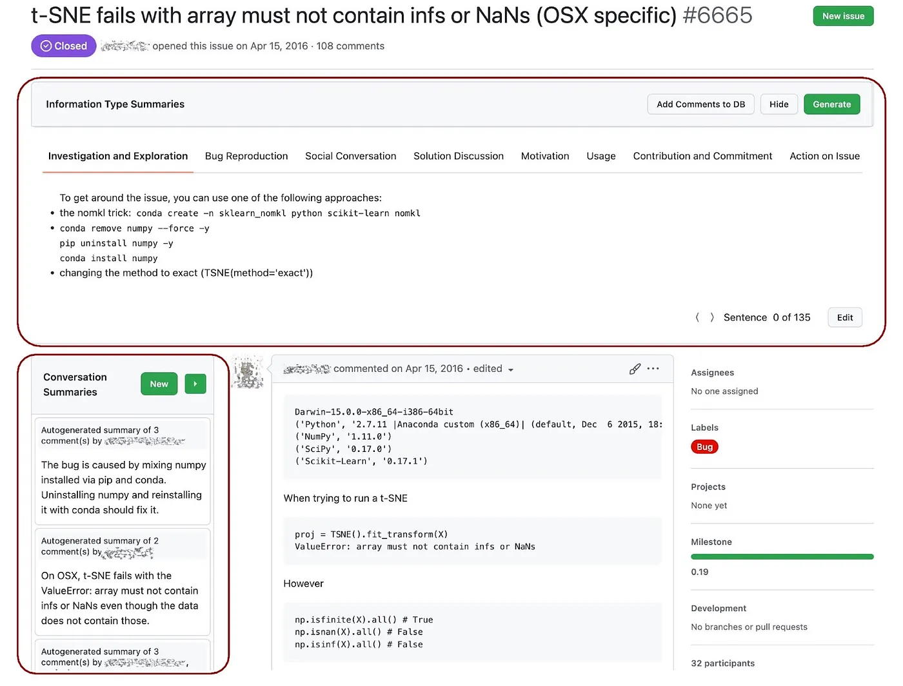

# Installation Instructions
There are three parts to this repo, the extension elements are located in the `extension` branch, the backend is located in the `backend` branch and the code and the model for the summarization engine is located in the `engine` branch. 

### To install the summarization engine
Use the `engine` branch. We deployed the engine on GCP, and the code reflects this deployment. However, if you want to deploy the content locally, then use the function to deploy. 

### To run the backend
Use the `backend` branch. 

### To install the extension
Ensure that you have Node v18. run `npm run install` to install the necessary packages. Then run `npm run build` to build the extension. The extension should build in `dist` folder. Once the extension is built, go to the extension tab of Chrome or a Chromium based browse, and select the `load unpacked` option and select the `dist` folder. The extension should be loaded. Note that if the extension is loaded before the backend and the summarization engine, it is possible for the plugin to crash. 

### Troubleshooting
Create an issue for any bugs or feature requests. 


----------
# Chrome Extension
The `extension` branch contains the code for the Chrome extension that provides the user interface for generating and viewing issue summaries. The extension uses Node.js version 18. 

## Setup
### Installing Dependencies
Clone the repository and install the required npm packages:
```bash
npm install
```

### Configuration
Before building the extension, make sure to run the backend code lcoated in `backend` branch. Create a `.env` file in the project root to store the backend API. 
```bash
API_BASE_ROUTE=http://localhost:5000 # Or the appropriate backend URL
```

### Building the Extension
The extension needs to be built before it can be loaded into Chrome. Run the following command to create a production build:
```bash
npm run build
```
This will create a `dist` directory containing the built extension files. For development, you can use the watch mode to automatically rebuild when files change.
```bash
npm run watch
```

## Loading the Extension in Chrome
### Developer Mode
1. Open Google Chrome
2. Navigate to `chrome://extensions/`
3. Enable "Developer mode" using the toggle switch in the top right corner

### Loading the Extension
1. Click the "Load unpacked" button in the top left
2. Navigate to the `dist` directory in your project
3. Select the directory to load the extension

The extension icon should now appear in your Chrome toolbar.

## Using the Extension
The extension adds two main components to the GitHub Issues interface: **Conversation Summary** and **Information Type Summary**. The conversation summary panel is located on the left side of the issue thread and the information type summary panel is located at the top of the thread.



Both panels remain accessible while scrolling through the thread. The information type summary converting to a navigation bar that stays fixed at the top of the viewport.

### Features of Conversation Summary Panel
#### Creating New Summaries
- Click the `New` button in the conversation summary panel
- Select comments to include by clicking the add button that appears on each comment
- Previously summarized comments will be grayed out
- Review selected comments in the comment view panel
- Click "Generate" to automatically create a draft summary
- Edit the generated summary if needed (supports markdown format)
- Save the summary to add it to the collection

#### Managing Summaries
- View all summaries in a list format. The panel supports resizing for a larger view.
- The summaries are attributed to the author.
- Click any summary to:
    - Highlight and navigate through summarized comments in the thread.
    - Comments are autoscrolled in a long thread.

#### Edit and delete existing summaries using the edit button
- Click the pencil icon on the top right to manually edit the summary.
- Delete summaries by clicking on the 
Resize the summary panel for better visibility

### Features of Information Type Summary Panel
#### Generating Information Type Summaries
- First time you navigate to an issue, you need to click on the `Generate` button to automatically generate the summaries. These get stored in the DB, so you only have to do it once. 
- Summaries are organized in horizontal tabs, sorted by frequency of sentences in the thread corresponding to the information type. Each tab shows:
    - Summary content
    - Edit button for modifying content
    - Navigation controls for finding relevant content in the thread
- Hide button to minimize the panel
- Sentence counts for each type are displayed in the bottom right.

#### Edit summaries
- Click on the `Edit` button on the summary panel to manually edit the summary.
- Mark unmarked sentences with information types or correct incorrectly classified information types

#### Navigate to specific sentences in the thread using the navigation buttons
- Use the minimized navigation bar when scrolling to access quick navigation controls.


## Development Guidelines

### Project Structure
```
├── src/
│   ├── components/
│   ├── content/
│   ├── endpoints/
│   ├── scripts/
│   ├── types/
│   ├── utils/
│   ├── background.js
│   ├── constant.js
│   ├── content_script.js
│   ├── popup.js
│   └── style.scss 
├── dist/
├── webpack/
│   ├── webpack.common.js
│   ├── webpack.dev.js
│   └── webpack.prod.js
├── package.json
└── tsconfig.json
```
The `components/` and `content/` directories contain the code for the two panels. `scripts/` and `utils/` contain utility scripts. `background.js`, `content_script.js` and `popup.js` are necessary files for a chrome extension and are the starting point to understand the code. The project uses `webpack` to bundle the extension.

### Making Changes
- Make changes to the source files in the `src` directory
- Run the build command ``npm run build` or `npm run watch`. This in turn runs the `webpack` build command and generates the final `manifest.json`

### Reloading the Extension
- Rebuild the extension using `npm run build`
- Go to `chrome://extensions/`
- Click the refresh icon on the extension card
- If the changes aren't visible, try removing the extension and loading it again. 

## Common Issues
### Extension Not Loading
- Ensure Developer mode is enabled
- Check that the `dist` directory contains all necessary files
- Verify manifest.json is properly formatted
- Look for errors in the Chrome DevTools console

### API Connection Issues
- Verify the backend server is running
- Check BACKEND_API_URL in your .env file
- Ensure proper CORS headers are set in the backend
